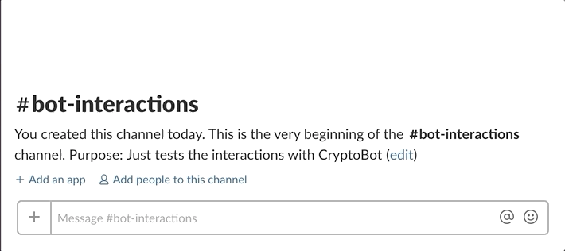

# What is CryptoBot
CryptoBot is an RTM slack bot that when added in your workspace sends you cryptocurrency rates on the channel you tagged him in. It is written in **Go** and uses [nlopes'](https://github.com/nlopes/slack) library and the [coinlayer API](https://coinlayer.com)

# Usage
CryptoBot is an RTM bot so all you have to do is add him in your workspace, tag him using `@CryptoBot` and use one of the 2 commands 

 - help : just displays a hello and description message
 - cryptocurrency symbol (e.g ETH) : will display the rate of that cryptocurrency

